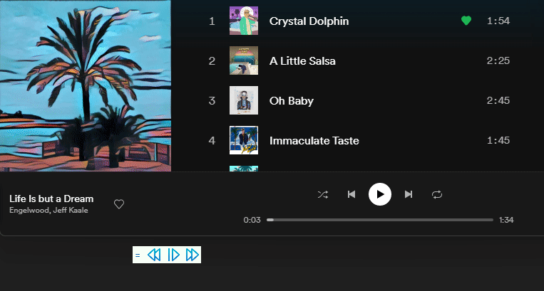
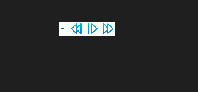
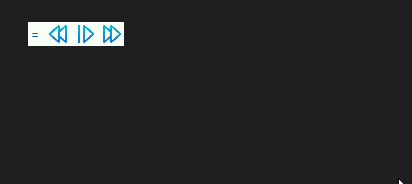
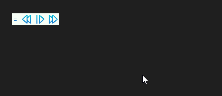

# PikoPlayer
Always-on-top small bar to control music playback. It simulates media key button presses, so it is perfect substitution for keyboard lacking keys to control playback.

It requires .NET 6 Desktop Runtime to run: [download](https://dotnet.microsoft.com/en-us/download/dotnet/thank-you/runtime-desktop-6.0.1-windows-x64-installer)

Newest PikoPlayer version can be downloaded [here](https://github.com/gosukretess/PikoPlayer/releases)

## Features

### :musical_note: Control music playback using PikoPlayer's buttons :musical_note:

### :sound: Adjust volume by hovering over PikoPlayer and scrolling mouse wheel :mute:

### :signal_strength: Change size of the PikoPlayer :signal_strength:

### :heart: Select your favourite theme! :yellow_heart:

## Available themes

| Preview        | Theme Name           |
| ------------- |:--------------|
|      | Snowy Iceberg |
|      | Deep Ocean |
|      | Juicy Grapefruit |
|      | Synthwave Night |
|      | Daylight Amethyst |
|      | Sparkling Lime |
|      | Pink Bubblegum |
|      | East Coast |
|      | Hawaiian Dream |
|      | Refreshing Mint |
|      | Lapis Lazuli |
|      | Shiny Ruby |
|      | Neon City |
|      | Imperial Topaz |
|      | Amazon Forest |

## Known issues

### - PikoPlayer hiding under system taskbar
Unfortunately Windows always brings taskbar at the first place, so you can't put PikoPlayer on top of it. In case it hides under Windows taskbar, right click PikoPlayer icon in system tray and select "Reset Position".

## Credits

Code by [Kretess](https://github.com/gosukretess)

Icons by [apien from flaticon.com](https://www.flaticon.com/authors/apien)

Themes by [Szeroki Geralt](https://github.com/szerokigeralt)